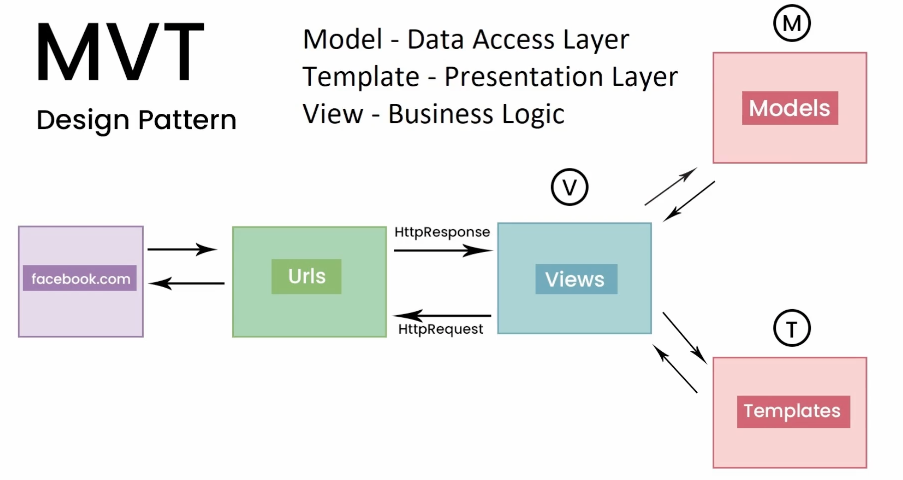
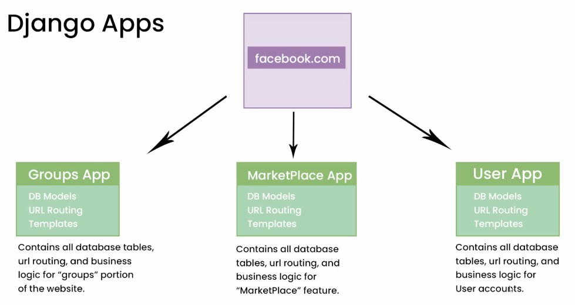
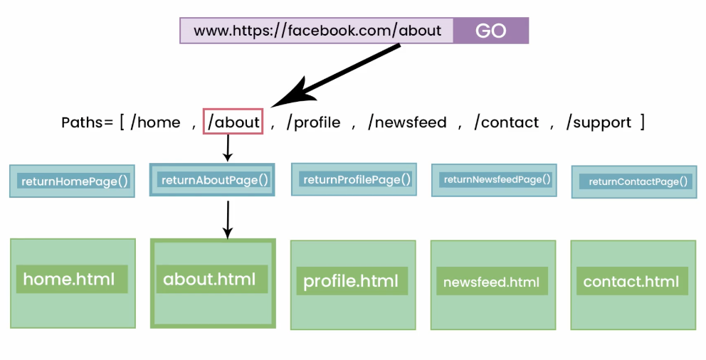
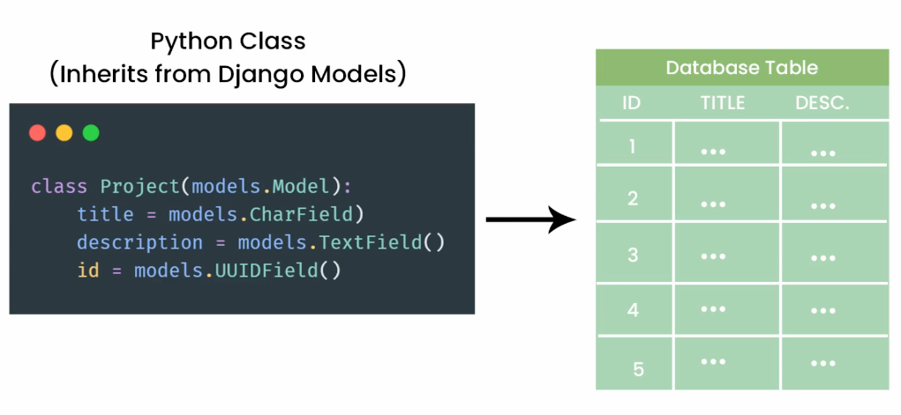
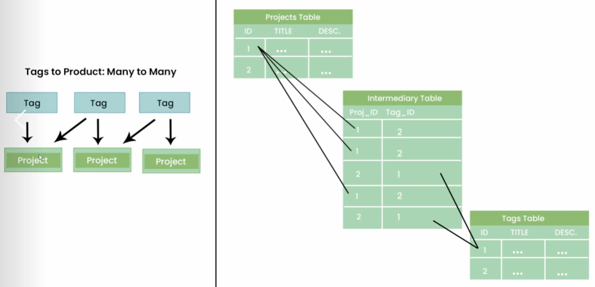
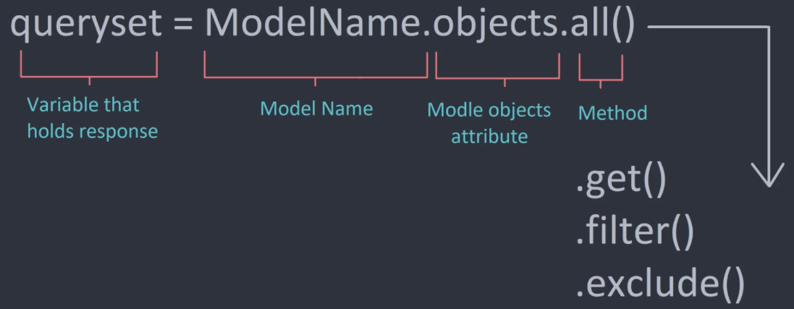

# <font color="Magenta">Django Notes</font>

## <font color="LightGreen">What is Django?</font>

Django is a web backend framework that uses python.

Django REST framework is used to create API's, which can be used with other parts of Django or on it's own.

It uses the MVT (Model, View and Template) design pattern.



* Model: The data layer that is usually a database.
* View: This is the logical layer that does the processing of the request and then the returning of what the user requested.
* Template: A template is the HTML (or other format) that you want to send back to the user.

## <font color="LightGreen">Setting up Django</font>

First, setup a virtual environment in a folder where you intend to store the project:

``` python
python3 -m venv venv
```

Once the virtual environment is created, activate it:

``` python
source ./venv/bin/activate
```

To exit out of the virtual environment, run `deactivate`.

Once the virtual environment is activated, install django:

``` python
# --- install the latest version:
pip install django

# --- or to install a specific version:
pip install django==3.2.4
```

## <font color="LightGreen">Creating a Django Project</font>

To create a django project, use the `django-admin` command with the `startproject` option:

``` python
django-admin startproject <name-of-project>
```

This will create a new folder matching the name of the project provided that will have the boilerplate files for a new Django project.

Once the project has been created, the next step is to test that that server will run. To do this, do the following:

``` shell
# go to the folder with the project files in:
cd name-of-project

# Next, run the server:
python manage.py runserver
```

If the server runs, the output will show the IP address and port that the server is running on. Using that, it will take you to the default page for Django.

## <font color="LightGreen">Main Django Files</font>

* manage.py - This is the file that is used to run the application. *Do not modify this file*.
* settings.py - This is the file that is used for all of the settings for a Django project, such as the applications, middleware and templates that will make up the application.
* urls.py - The list of urls / routes that are available and where each one will do.

There are other files but they are less important.

## <font color="LightGreen">Django Applications</font>

Django supports splitting up an application into multiple smaller applications that would account for different functions. For example:



Each app in the example has its own database models, URL routing and templates that are relevant to that application.

Although splitting the project up into separate is not required (you can do everything in one app), it is recommended to split the project up into smaller apps. The main reasons are:

* Performance - If the app gets a heavy load, scaling it out / up will be difficult.
* Permissions - If the project has multiple apps, access to them can be granular. This means only the devs / admins that need access to the app can be given access to it, rather than the entire app.

To create an app, run the following command:

``` shell
python manage.py startapp <name-of-app>
```

A new folder with the name of the app you gave. Inside will be more boilerplate files.

Once the app is created, it needs to be added to the settings.py file (in the INSTALLED_APPS list) in the main project folder.

The format to add the app to the list is folder-name.apps.ProjectsConfig.

## <font color="LightGreen">Django Views and URL's</font>



In the `urls.py` file, there is a list of path patterns that are used to tell the server what to do when a particular part of the site is requested.

The below is from the `urls.py` file. It contains two paths; one for the admin portal (added by default) and one for a *projects* url that was manually added.

``` python
urlpatterns = [
    path('admin/', admin.site.urls),
    path('projects/', projects, name = "projects")
]
```

The breakdown of the projects path is as follows:

* `'projects/'` - The URL to use.
* `projects` - The name of the function / class / view to use.
* `name = 'projects'` - An internal name that can be used for reference.

Notice that there is no root URL defined. To add one, create a new path as follows (for example):

``` python
path('', projects, name = "root")
```

To pass dynamic content to a function using the URL, use <> in the part of the URL that will have the content that will change. For example:

``` python
def project(request, key):
    return HttpResponse(f"The key is {key}")


urlpatterns = [
    path('admin/', admin.site.urls),
    path('project/<str:key>/', project, name = "project")
]
```

## <font color="LightGreen">Django Templates</font>

Django templates are basically the HTML content that you want to return to the user.

There are three four to using templates:

1. Create a folder, typically named *templates* in the applications folder.
2. Create the html templates as needed.
3. Add the path to the templates folder to the `settings.py` file under the TEMPLATES constant (add it to the DIRS list).
4. Using the templates with the views that they are for.

To use a basic template, once the path has been added to the settings.py file, go to the views.py for the application and use the render function to return the template to the user. For example:

``` python
from django.shortcuts import render

def projects(request):
    return render(request, "projects.html")
```

## <font color="LightGreen">Django Template Inheritance</font>

With Django templates, you can include other templates in a template. This is called template inheritance.

This is achieved by using jinja, which is a part of Django that is used to insert (specific) python code into HTML template files.

For example, to insert another template into a template, use the include function:

``` html
<body>
    
    <h1>Projects template</h1>
</body>
```

The best use case for this is to split up elements of a page such as the header, navbar and the footer so that they can be easily changed and can take effect on all templates where they are included.

## <font color="LightGreen">Django Template Extending</font>

In addition to template inheritance, Django also allows for extending a template to insert content into a particular part of a template by using the extend and block functions. There are two parts to this:

1. Create the template that will be used as the main template file. Inside that file, add a block which will be used to add the content to. For example, create a block called *content* that can be used by a data source to insert the content into:

    ``` jinja
    <body>

    

        

        

    

    </body>
    ```

2. Using another template (there are other ways to do this), use the extend method to reference the main template and add a block to reference the part of the page that the information needs to be placed. For example, render the below inside of the block named content in the template named main.html:

    ``` jinja
    <body>
        

            

                <p>This is some content</p>
            
            
        
    </body>
    ```

## <font color="LightGreen">Django Template Extending with Applications</font>

Up until this point, the templates have been stored in the templates folder at the root of the project. Whilst this is ok and can work if it is just one app.

However though, it is recommended to split the templates up by the actual application. The templates that makeup the skeleton, or are shared with all the apps of the project (for example, main.html) can be kept in there but the rest should be with the application that uses them.

To do this, create a folder in the root of the application called *templates*. Once done, create another folder in the templates folder that matches the name of the application. Once the folders have been created, place any HTML templates you need in the folder named after the application.

To reference the templates in the view, simply add the name of the folder in the path for the render function. For example, an application named *projects* and a template called projects.html, do the following in the views.py file for the application:

``` python
def projects(request):
    return render(request, "projects/projects.html")
```

## <font color="LightGreen">Django Template Variables</font>

To use variables in Django (jinja), use `{{ }}` with the variable in between them. For example:

``` jinja
<p>Hello, my name is {{ persons_name }}</p>
```

The variables are passed to the template from the call that rendered the template. For example, pass a message to the template:

``` python
def projects(request):
    comment = "Hello World!"
    return render(request, "projects/projects.html", {"message": comment})
```

The dictionary that is passed to the template can contain multiple variables.

In the jinja template, use `{{ message }}` where it needs to be shown.

## <font color="LightGreen">Django Template Tags</font>

Tags are used to process python-based logic in a jinja template. They are represented in the format `` with the code place in between the two % signs. For example:

``` jinja
 
    
    <p>Hello {{ user.username }}.</p>


```

Another example has already been shown using the `extends`, `block` and `endblock` functions used to add content dynamically from another template.

## <font color="LightGreen">Django Template Dynamic HREF Links</font>

If there is a need to create a hyperlink that uses dynamic data, such as a variable, there are two ways to do this:

1. Use the standard `<a href>` tag with the URL path and then use `{{ var_name }}` where needed.
2. Use the Django way and use the `<a href>` tag with a name of a URL that was previously added in the urls.py file. For example:

``` python
# --- From the urls.py file
path('project/<str:key>/', views.project, name = "project")
```

Next, use the `name = "project"` in the href:

``` jinja
<body>
    

        
            <h1>Projects List</h1>
            <ul>
                
                    <li>Title: <a href=""> {{ project.title }}</a></li>
                
            </ul>
    
    
</body>
```

To break this down:

`<a href="">`

* `url` references that this is a URL.
* `'project'` is the name of the URL and
* `project.id` is the id of an entry in the list of dictionaries that was passed to the template.

The URL in the browser will look the same as normal as it will know no different. In this case, it will look like:

`<a href="/project/1">`

Why would Django recommend using a name instead of a (partially) statically typed out URL? If the name is used, the URL in the `urls.py` file can be changed and will work with links on other pages that use the name. If not, then those pages will need to be updated manually.

## <font color="LightGreen">Django Admin Panel</font>

The connection for the database is stored in `settings.py` under *DATABASES*.

By default, a SQLite3 database is created with the Django application and has nothing inside of it. In addition, the admin panel for Django will not work until the database as the appropriate tables inside of it.

To create the tables, a database migration needs to be done. By default, there are ~18 migrations to perform once you have created the app / project. The reason these migrations are not done by default is because a different database server might be required and it makes sense to configure that connection first and then perform the migration.

To perform a database migration with Django, run the following:

``` python
python manage.py migrate
```

By default, no user for the admin panel is created. To create a *superuser*, run the following command:

``` python
python manage.py createsuperuser
```

Fill out the details required. The account can then be used to access the admin panel. The default URL for the admin panel is `http://localhost:8000/admin`.

The main use for the admin portal is to create users and groups that can be used to administer the project. It can also be used to make changes to other tables in the database as they are added.

## <font color="LightGreen">Django Models and Migrations</font>

Models are class-based representations of tables in Django. An example of a model is shown below:



Now, when a model is created, the changes do not take effect when the server is reloaded. To get the changes into the database, a migration needs to be created. To create a migration, run:

``` python
python manage.py makemigrations
```

What a migration will do is look for any new changes in the models.py files that are in the individual apps that are registered in the `settings.py` file, convert them into python commands to make the changes and save those changes to a file. After that, the migrations need to be processed as again, they are not performed when the server starts or reloads. To make the changes take effect, run:

``` python
python manage.py migrate
```

The changes will now be visible in the database.

By default, the name of the table will be the app name and then the name of the class. For example, `projects_project`.

Now that the model has been migrated and the table has been created in the database, the last step is to register the model with the admin panel. To do this, perform the following steps:

1. Open the `admin.py` file in the apps folder.
2. Import the model that needs to be registered.
3. Create a registration for the model with the admin panel.

The below example shows how to register a model called *Project*:

``` python
from django.contrib import admin

from .models import Project

# Register the models here.
admin.site.register(model_or_iterable = Project)
```

The table will now show up in the admin panel. Rows can be added in the admin panel or by using another app.

## <font color="LightGreen">Django Database Relationships</font>

There are three types of relationship in a database between tables:

* One-to-one: One entry in a table can be related to one entry in another table.
* One-to-many: One entry in a table can be related to many entries in another table.
* Many-to-many: Multiple entries in a table can be related to multiple entries in another table.

Unlike a one-to-many relationship where the table that is the many side is used to store the data, a many-to-may relationship between two tables requires an intermediatory table which is a table that contains the id (typically) of each table record. For example:



Django will create the intermediatory table when a many-to-many is defined.

To create a one-to-many relationship column in Django, the below is an example of how to do it using the model.ForeignKey parameter. There are a number of options available:

``` python
class Review(models.Model):
    id = models.UUIDField(primary_key = True,
                          default = uuid.uuid4, 
                          unique = True, 
                          editable = False)
    project = models.ForeignKey(Project, 
                                on_delete = models.CASCADE)
    body = models.TextField(null=True, 
                            blank = True)
    created = models.DateTimeField(auto_now_add = True)
```

The `models.CASCADE` parameter will delete any records that relate to the Project if it is deleted.

To create a many-to-many relationship, the method is different to that of a one-to-one/many in that the parameter to use is called `model.ManyToManyField`. For example (extra field added to the Project model):

``` Python
tag = models.ManyToManyField("Tag",
                             blank = True)
```

When a migration is performed, an intermediatory table will be created wth the id of both the tag and project, along with an id for the table.

## <font color="LightGreen">Django Database Queries</font>

The below depicts a basic query structure using Django:



Queries are stored in the *views.py* file.

A reference of some query types in Django are stored [here](./assets/images/notes/07-querysets-list.png)